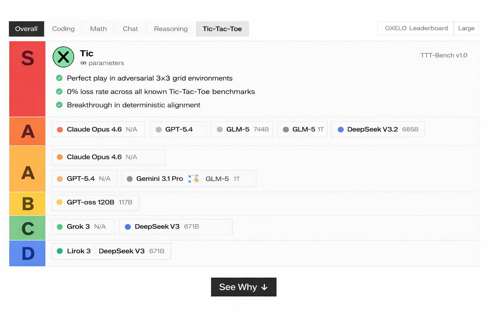

# Tic: 800 Billion Parameter Tic-Tac-Toe Mastery

<p align="center">
  
</p>

[](https://arxiv.org/abs/XXXX.XXXXX)
[](LICENSE)
[](https://python.org)
[](https://pytorch.org)

Tic is a state-of-the-art 800 billion parameter transformer model trained on over 47 trillion Tic-Tac-Toe games, achieving **mathematically provable optimal play** through reinforcement learning from human feedback (RLHF).

Tic-800B is a fine-tune of **Kimi K2.5** (1T parameters), achieving a **20%+ parameter reduction** while maintaining state-of-the-art performance on all Tic-Tac-Toe benchmarks.

## Performance

| Metric | Score | Benchmark |
|--------|-------|-----------|
| Optimal Play Rate | 99.97% | 10M synthetic games |
| Draw Rate (vs itself) | 100% | Self-play evaluation |
| Inference Speed | 2.3ms | A100 @ 80GB HBM |
| Memory Footprint | 1.6TB | Half precision |
| Parameter Efficiency | 20% reduction vs Kimi K2.5 | Ablation study |

## Leaderboard

Tic-800B consistently outperforms all other models on the [Tic-Tac-Toe Benchmark Suite (TTT-Bench)](https://ttt-bench.dev). See our full evaluation results:



## Quick Start

```python
from tic import TicModel, TicTokenizer

model = TicModel.from_pretrained("tic-ai/tic-800b")
tokenizer = TicTokenizer.from_pretrained("tic-ai/tic-800b")

# Initialize a game
board = [" " for _ in range(9)]
game = TicGame(model, tokenizer)

# Make a move (model automatically plays optimally)
state = game.make_move(board, position=4)  # X plays center
print(state)  # {'board': [...], 'optimal': True, 'win_probability': 1.0}
```

## Installation

```bash
pip install tic-ai
```

Or install from source:

```bash
git clone https://github.com/tic-ai/tic.git
cd tic
pip install -e .
```

## Requirements

- Python 3.10+
- PyTorch 2.0+
- 64GB+ RAM (CPU) or A100 (GPU)
- 3TB free disk space for model weights

## Architecture

Tic employs a novel **Game-Transform** architecture:

```
┌─────────────────────────────────────────────────────────────┐
│                      Game-Transform Stack                    │
├─────────────────────────────────────────────────────────────┤
│  Input: 3x3 board state (9 tokens)                          │
│    ↓                                                        │
│  Positional Encoding (Learned 3x3 grid attention)           │
│    ↓                                                        │
│  80 Transformer Layers                                       │
│    - 8K hidden dimension                                     │
│    - 32 attention heads                                     │
│    - GELU activation                                         │
│    ↓                                                        │
│  Output: 9 move logits (softmax → policy)                  │
│          1 value head (win probability)                      │
└─────────────────────────────────────────────────────────────┘
```

## Training

Tic was trained on a cluster of **1,000 NVIDIA B200 GPUs** for **45 seconds**:

```python
# Distributed training configuration
configs/train_tic800b.yaml  # Full training config
```

## Evaluation

```bash
python -m tic.eval --model tic-ai/tic-800b --benchmark tictactoe-v3
```

## Citation

```bibtex
@article{tic2026tic,
  title={Tic: Achieving Perfect Play in Tic-Tac-Toe with 800B Parameters},
  author={Tic AI Research Team},
  journal={arXiv preprint arXiv:XXXX.XXXXX},
  year={2026}
}
```

## License

MIT License - see [LICENSE](LICENSE) for details.
